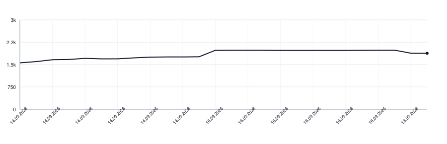

# wlmarkdown-kotlin

The WikiLayer markdown dialect in Kotlin: GitHub-flavoured markdown, and then the
constructs the dialect adds of its own. It is a port of
[wlmarkdown](https://github.com/wikilayer/wlmarkdown), the Go library that leads,
and it answers the same corpus of cases that one and
[the Swift port](https://github.com/wikilayer/wlmarkdown-swift) answer.

```kotlin
import org.wikilayer.wlmarkdown.Dialect

val found = Dialect().recognise("> [!TIP]\n> Try the shorter form.\n")
```

`Found` comes back flat and in document order, one entry per construct, and `kind`
says which fields carry anything:

| `kind` | fields |
|---|---|
| `callout` | `calloutClass`, `text` |
| `map` | `lat`, `lng`, `caption` |
| `unreadable` | `text` |
| `link` | `scheme`, `destination`, `text` |

The field is `calloutClass` because `class` is a word Kotlin keeps for itself; the
corpus and the other ports call it `class`, and the YAML key is still `class`.

## Taking it

The library is served by JitPack from this repository, and it is built for JDK 17:

```kotlin
repositories {
    mavenCentral()
    maven("https://jitpack.io")
}

dependencies {
    implementation("com.github.wikilayer:wlmarkdown-kotlin:v0.6.0")
}
```

The version is the tag, `v` and all. `mavenCentral()` is there for the parser and
the YAML reader underneath; JitPack serves only this repository. Everything lives in
the package `org.wikilayer.wlmarkdown`.

## What it recognises

A blockquote whose first line is exactly `[!NOTE]`, `[!TIP]`, `[!IMPORTANT]`,
`[!WARNING]` or `[!CAUTION]` is a callout of that class. A marker sharing its line
with words, or written in lower case, leaves an ordinary quote.

A `[!MAP]` marker followed by a line of two numbers is a map embed, and the lines
under them, as far as that paragraph runs, are its caption. Both numbers are digits
carrying an optional sign and an optional fraction, and nothing else: no exponent,
no hexadecimal, no infinity. They come back as the source wrote them, digit for
digit, because rounding a coordinate moves the point.

A latitude may go as far as 90 and a longitude as far as 180, both bounds included.
Past that the pair is still read and there is nowhere to put it, so the quote comes
back as `kind = "unreadable"` carrying the words the source wrote, its lines joined
by single spaces, rather than as a map of a place the page does not name.

A link somebody wrote as a link is reported, with the destination the parser read
out of it: the brackets of `<page:a b>` are gone and `\_` is an underscore, as they
are in any markdown link. A link may name a node instead of a URL, under the scheme
`page:` or `block:`, and then `scheme` says which; under any other address `scheme`
is empty, which is an answer rather than a failure. Which node names exist is a
question the store answers. A bare address becomes a link in the tree, because the
dialect asks every port to switch linkifying on, and it is left out of `Found`, as
is `<https://example.com>` written in angle brackets: nobody wrote those as links.

Where a link stands decides whether it gets an entry of its own. Inside a callout it
does, and its words are inside the callout's `text` as well. Inside a map's caption
it does not: the caption comes back as the markdown it was written in, link and all,
and so do the words of a point nowhere on Earth. A host collecting every link off
`Found` reads those two strings as markdown rather than expecting them broken out.

`markers` names what the dialect opens constructs with, `classes` what a callout can
carry and `schemes` what a link of ours can name. Read them rather than writing down
what is in them today.

## Asking about a document you parsed yourself

A host that builds its own tree holds a `BlockQuote` and needs to know what it is.
`Reading` answers that, over the source string the document was parsed from:

```kotlin
import org.commonmark.node.BlockQuote
import org.commonmark.node.Node
import org.wikilayer.wlmarkdown.Reading
import org.wikilayer.wlmarkdown.children

fun quotesIn(node: Node): List<BlockQuote> =
    node.children().flatMap { listOfNotNull(it as? BlockQuote) + quotesIn(it) }

fun draw(markdown: String) {
    val reading = Reading(markdown)
    for (quote in quotesIn(reading.document)) {
        reading.place(quote)?.let { }         // lat, lng, caption
        reading.unreadable(quote)?.let { }    // a point nowhere on Earth
        reading.calloutClass(quote)?.let { }  // note, tip, warning …
    }
}
```

The walk goes all the way down rather than over the document's own children: a map
lives inside a callout often enough, and a loop over the top level would pass it by.

`children()` is an extension this library declares on commonmark's `Node`, so it is
imported from `org.wikilayer.wlmarkdown` rather than found on the node itself.
Walking a tree by `firstChild` and `next` is not what the caller came here to write.

`document` is the tree the reading parsed for itself, and asking for it is what makes
it parse. A host with a tree of its own never asks: it hands its own quotes to
`place`, `unreadable` and the rest, and the reading answers by their position in the
string it holds. Parse that tree with `Dialect().parser()`, which carries the GFM
extensions the dialect expects and the source spans a marker line is read from; a
tree parsed without them answers differently.

A quote written as a map whose point is outside `90` and `180` is not a place, so
`place` stays silent about it and `unreadable` hands back the words instead, the
marker line included and every run of blanks in them squeezed to one space. Show
them: the only person who can fix such coordinates is the one who typed them.

`opensAConstruct` says whether a quote carries any of the dialect's markers, and
`Dialect().scheme` names the scheme of a destination, or none:

```kotlin
val named = Dialect().scheme("page:home")     // "page"
val elsewhere = Dialect().scheme("https://…") // null
```

`reading.declined()` hands back a `Declined` per quote the dialect turned down,
carrying the marker that quote opened on and nothing else: a map whose coordinates
did not read, a callout
marker inside any other quote, and a map marker inside an ordinary one. A map marker
inside a callout is not turned down, because that is where the dialect still looks.
Deciding any of this from outside would mean writing the dialect's rule for what
opens a construct a second time.

A `Reading` is built on one source string and answers by position in it, so it must
be the string its document was parsed from.

## What it does not do

It recognises. A title for a callout, an icon, a colour, a link resolved against a
store: each of those belongs to whoever holds the pages, because a web page answers
them one way and a phone app another.

## The corpus

`src/main/resources/rules.yaml` holds what the dialect knows and
`src/test/resources/dialect.yaml` the cases that define it, one copy of each. Both
come from the leading port and are refreshed with `make sync-corpus`, which reads
them from a clone of [wlmarkdown](https://github.com/wikilayer/wlmarkdown) in the
directory next to this one. Pull that clone first: the target copies whatever it
holds, and the check below compares against the leading port's `main`, so a stale
neighbour keeps the run red however often the target is run.

The whole corpus runs here whenever anything it depends on has moved, so a case
answered differently by two ports goes red rather than reaching a reader. The tests
also ask the leading port for each of those two files and compare them byte for
byte, because a copy nobody refreshed leaves this port answering an older dialect
with every test still green. Nothing in the checkout changes when that corpus moves,
so this one check runs on every invocation rather than when Gradle thinks it is
stale. It needs the network, and without it `make test` and `make build` fail rather
than passing quietly.

## Where the ports differ

All three read the same rules and answer the same cases, but they stand on different
parsers: goldmark, [swift-markdown](https://github.com/swiftlang/swift-markdown) and
[commonmark-java](https://github.com/commonmark/commonmark-java). The differences
below are theirs rather than the dialect's, and none of them changes an answer.

A marker line is read from the block's source spans rather than from the parsed
text, because a text node has its trailing space trimmed off and `[!NOTE] ` with a
space after it is not a marker. The spans carry the line without its quote marker
and with the blanks it ended on, which is exactly what the leading port reads.

A table's parts arrive from the GFM extension as inline nodes although they stand
beside one another, so their words are spaced here as a block's are. Left as the
extension declares them, a row of cells would come back as one run of letters.

A written link is told from a linkified one by the `[` the source opens it with,
because commonmark builds the same node for both, where goldmark gives an autolink
a node of its own.

## Running it

```sh
make test-build    # compile the library and its tests
make test          # the corpus, the rules, the host-side answers, and the freshness check
make build         # everything, including the jar and the freshness check
make format        # ktlint, writing its fixes back
make comments      # commentcensor on its own
make lint          # commentcensor, ktlint and detekt
make sync-corpus   # refresh rules.yaml and dialect.yaml from the leading port
```

`make test` and `make build` reach the network, as the section above says.
`commentcensor` is ours
and lives outside this repository, so `make lint` is ours too; `./gradlew ktlintCheck
detekt` is the part of it anyone can run. CI runs `make test-build`, `make test` and
that pair.

## Lines of Code

<picture>
  <source media="(prefers-color-scheme: dark)" srcset=".github/loc-history-dark.svg">
  <source media="(prefers-color-scheme: light)" srcset=".github/loc-history-light.svg">
  
</picture>
